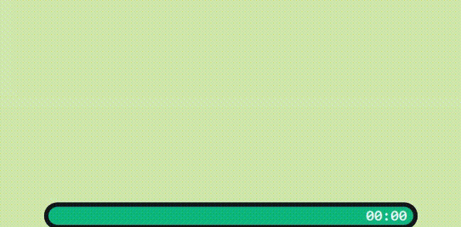

# FocusCapsule

English | [中文](README.zh.md)

A minimal Windows focus timer that lives as a slim bar at the bottom of your screen — inspired by the Dynamic Island aesthetic.



## Acknowledgement

The core idea of **randomised micro-break reminders** during a focus session comes from **择恩** and was first described in [this video](https://b23.tv/Ovxmg6q). All credit for that concept goes to them. FocusCapsule is simply a desktop implementation of their approach.

## Features

- **Slim bottom bar** — a dark pill hugging the bottom edge of your primary monitor
- **Focus countdown** — configurable session length with a live progress bar
- **Random micro-breaks** — fires at unpredictable intervals within your min/max range; the randomness prevents habituation
- **Finish rest** — cooldown period after the session ends
- **Rest animation** — progress bar shrinks symmetrically from the center during rest countdowns
- **Edge snap** — drag the bar to the left or right edge and release; it slides back to the center
- **Pause / Resume** — pause at any time without losing progress
- **Hover to expand** — settings panel appears on hover; right-double-click anywhere on the bar to quit
- **Auto-save** — config persists between sessions

## Requirements

- Windows 10 / 11
- Python 3.11+

## Setup

```bat
pip install -r requirements.txt
python install.py
```

`install.py` writes the path of your current `pythonw.exe` to `.python-path` so the VBS launcher can start the app without a console window.

## Running

Double-click `focuscapsule.vbs` — no console window.

Or from a terminal:

```bat
python main.py
```

## Settings (hover to expand)

| Field | Description |
|---|---|
| 专注时长 | Focus duration (minutes) |
| 完成休息 | Rest duration after the session ends (minutes) |
| 微休息 | Micro-break length (seconds) |
| 休息间隔 | Random interval range for micro-breaks (min ~ max, minutes) |

**开始** — start · **暂停** — pause/resume · **结束** — end early · **重启** — restart with same settings

## Project structure

```
├── focuscapsule/
│   ├── qt_app.py        # Application core, state machine, tick loop
│   ├── state.py         # Session states and config dataclasses
│   ├── timer.py         # Monotonic focus/rest timer
│   ├── scheduler.py     # Random trigger-point generator
│   ├── config.py        # JSON config persistence (~/.focuscapsule/config.json)
│   └── ui/
│       ├── bar.qml        # QML UI — the bar itself
│       ├── bar_bridge.py  # Python ↔ QML bridge (signals/slots)
│       ├── bar_window.py  # Qt window management, Win32 mask, snap animation
│       └── win32_bar.py   # Win32 helpers (DPI, region mask, tool-window setup)
├── main.py            # Entry point
├── install.py         # One-time setup
└── focuscapsule.vbs   # Silent launcher (no console)
```

## License

MIT
